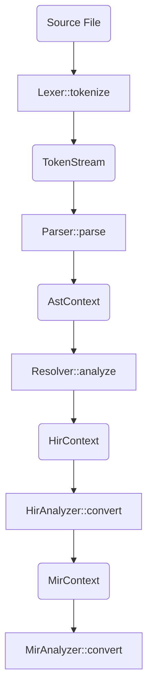
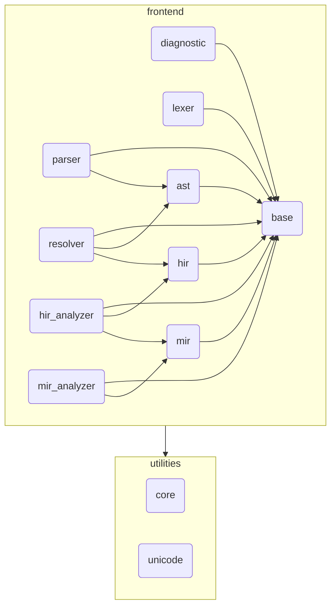

# Redy Frontend

## Summary

This directory contains the source code of the redy frontend, which is the most complex part of our project since we currently delegate the backend compilation process to LLVM IR.
Here's a high-level overview of the components:

## Processors

### Lexer
Tokenizes source code and output as a `TokenStream`
If the source code is lexically invalid, it reports source error

### Parser
Syntax analysis - parses `TokenStream` into an `AstContext`

### Resolver
Performs semantic analysis on the `AstContext` to resolve names and types, desugar, and convert it to `HirContext`.

### HirAnalyzer
Performs semantic analysis on the `HirContext` to optimize and convert it to `MirContext`.

### MirAnalyzer
Performs semantic analysis on the `MirContext` to check lifetimes and borrowing for safety.

## Main Data Structures

### File
Owns source code content as a UTF-8 encoded string.
All processors use this interface to get a reference to the code, enabling zero-copy access for memory efficiency.

### Utf8Stream
Stream for utf8 string that provides `peek()`, `next()`, `rewind()`, etc.

### TokenStream
Vector of tokens that provides `peek()`, `next()`, `rewind()`, etc.

### AstContext
Abstract Syntax Tree - Preserves only syntactic information, not semantic information.

### HirContext
High-Level Intermediate Representation - Desugared and semantically analyzed code

### MirContext
Mid-Level Intermediate Representation - SSA-based IR with a control flow graph (CFG), which is more suitable for rigorous analysis.

## Pipeline

### Processing Flow

### Module Dependency Graph

> [!NOTE]
> **AST**: **A**bstract **S**yntax **T**ree 
> **IR**: **I**ntermediate **R**epresentation 
> **HIR**: **H**igh-level **IR** 
> **MIR**: **M**iddle-level **IR** 
> **CFG**: **C**ontrol **F**low **G**raph 
> **SSA**: **S**tatic **S**ingle **A**ssignment 
