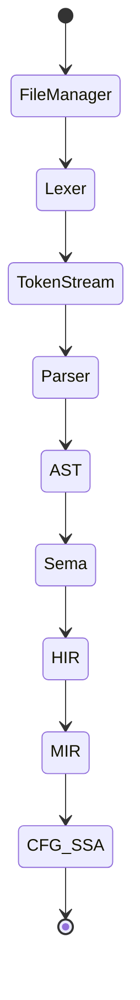

# Frontend

## Pipeline

### State Diagram

- **AST**: Abstract Syntax Tree
- **Sema**: Semantic Analysis
- **IR**: Intermediate Representation
- **HIR**: High-Level IR
- **MIR**: Middle-Level IR
- **CFG**: Control Flow Graph
- **SSA**: Static Single Assignment
