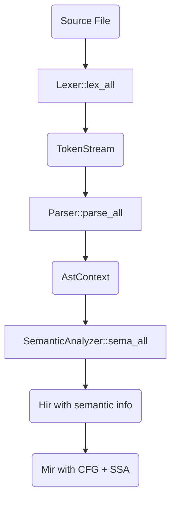
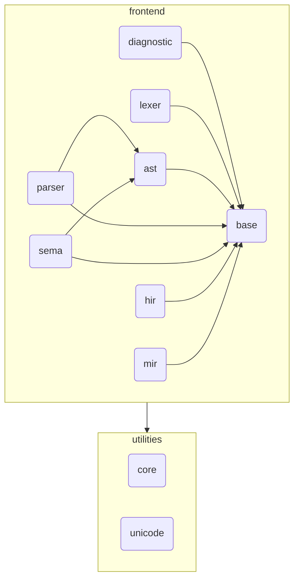

# Redy Frontend

## Summary

This directory contains the source code of the redy frontend, which is the most complex part of our project since we currently delegate the backend compilation process to LLVM IR.  
Here's a high-level overview of the components:

- **lexer**: Lexical analysis — converts source code into a stream of tokens
- **parser**: Syntax analysis — parses the token stream into an Abstract Syntax Tree (AST)
- **sema**: Semantic analysis — resolves names and types in the AST and lowers it to HIR
- **hir**: High-level Intermediate Representation — desugared and semantically analyzed code
- **mir**: Mid-level Intermediate Representation — SSA-based IR with control-flow graph

## Pipeline

### Processing Flow

### Module Dependency Graph

> [!NOTE]
> **ast**: **A**bstract **S**yntax **T**ree 
> **sema**: **Sem**antic **A**nalysis 
> **ir**: **I**ntermediate **R**epresentation 
> **hir**: **H**igh-level **IR** 
> **mir**: **M**iddle-level **IR** 
> **cfg**: **C**ontrol **F**low **G**raph 
> **ssa**: **S**tatic **S**ingle **A**ssignment 
